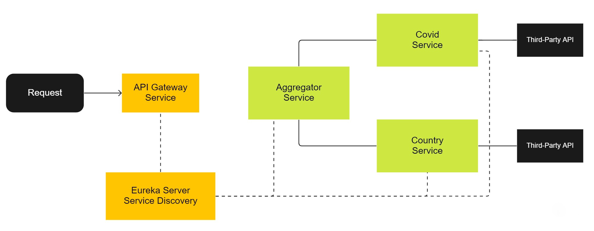

<h1 align="center">MicroServices</h1>
<p align="center">
Microservices for data aggregation about covid-19 and countries, based on Spring Cloud and Netflix Eureka
</p>

<p align="center">
	
	
</p>

<br/>

## :package:  Technology stack

* Spring Boot
* Spring MVC
* Spring Cloud Netflix Eureka Server
* Spring Cloud Netflix Eureka Client
* Spring Cloud Gateway
* Spring Cloud OpenFeign

## :ledger:  Services

| Service            | Endpoint                                          | Description                                          |
|--------------------|---------------------------------------------------|------------------------------------------------------|
| Eureka Server      | localhost:8761                                    | Service discovery                                    |
| API Gateway        | localhost:80                                      | Single entry point for all services                  |
| Country Service    | /countries-management/countries/{country-name}    | Provides information about countries                 |
| Covid Service      | /covid-management/countries/{country-name}        | Provides information about covid-19                  |
| Aggregator Service | /information-management/countries/{country-name}  | Aggregates data from `Country` and `Covid` services  |

## :rocket:  Example

```JSMin
GET http://localhost:80/covid-management/countries/japan

Response:
{"location": "Japan", "confirmed": 21887525, ...}
```

## :zap:  Quick start

Make sure you have JDK 1.8+ and Maven installed

```bash
-- Compile, build and run each application in each module
$> cd eureka-server && mvn spring-boot:run
$> cd country-service && mvn spring-boot:run
$> cd covid-service && mvn spring-boot:run
$> cd aggregator-service && mvn spring-boot:run
$> cd gateway-service && mvn spring-boot:run
```

## :whale2:  Quick start (Docker)

Make sure you have Docker and Docker Compose installed

```bash
-- Run all services
$> docker-compose up -d

-- Stop all services
$> docker-compose down

-- Stop and remove all services, images and volumes
$> docker-compose down -v --rmi all --volumes

-- Remove all unused containers, networks, images and volumes
$> docker system prune --volumes
```

## :factory:  Architecture



<br/><br/>